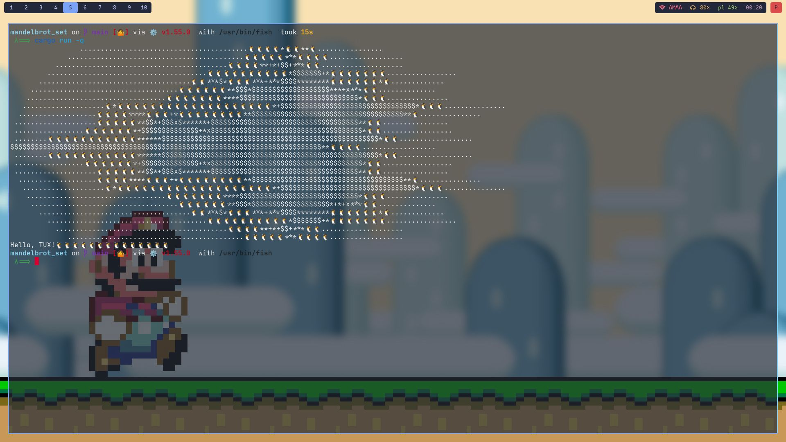

<h1 align="center">MANDELBROT(spelled correct) SET</h1>

> The term Mandelbrot set is used to refer both to a general class of fractal sets and to a particular instance of such a set. In general, a Mandelbrot set marks the set of points in the complex plane such that the corresponding Julia set is connected and not computable :].

